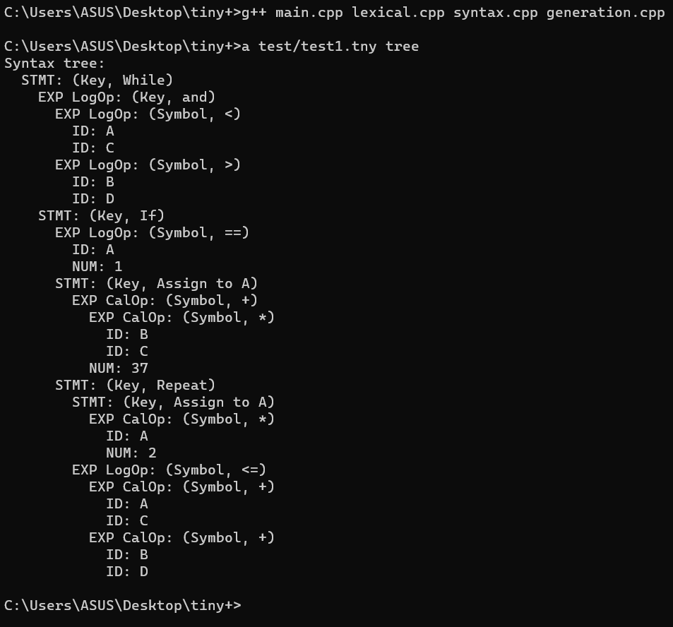
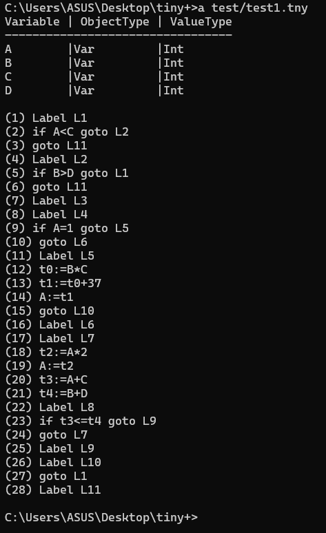
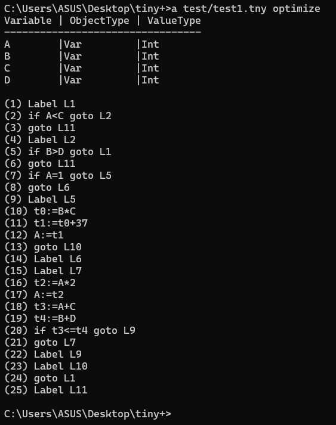

# 实验报告

### 实验环境

+ 操作系统：Win 10
+ 编译器：g++

### 实验目的

构造TINY＋的语义分析程序并生成中间代码

### 实验内容

构造符号表，构造TINY＋的语义分析器，构造TINY＋的中间代码生成器

### 实验要求

能检查一定的语义错误，将TINY＋程序转换成三地址中间代码。提交词法分析、语法分析和语义分析程序及中间代码生成的实验报告。

### 项目介绍

#### 文件夹结构

```
tiny+
|-- errors.h
|-- generation.cpp
|-- generation.h
|-- lexical.cpp
|-- lexical.h
|-- main.cpp
|-- syntax.cpp
|-- syntax.h
|-- test
    |-- lexical_illegal_input.tny
    |-- sematic_illegal_input.tny
    |-- syntax_illegal_input.tny
    |-- test1.tny
    |-- test2.tny
```

`errors.h`为错误信息管理文件，`lexical.cpp`和`lexical.h`为词法分析文件，负责生成词法分析token，`syntax.cpp`和`syntax.h`为语法分析文件，负责进行语法分析，生成语法树，`generation.cpp`和`generation.h` 负责生成三地址中间代码，`main.cpp`为主函数，`test`文件夹里的文件为测试文件。

#### 运行方式

进入`tiny+`文件夹目录，在命令提示符中输入：

```
g++ main.cpp lexical.cpp syntax.cpp generation.cpp
a test/test1.tny                        // 合法输入打印符号表和生成三地址中间代码测试1
a test/test2.tny                        // 合法输入打印符号表和生成三地址中间代码测试2
a test/test1.tny optimize               // 合法输入打印符号表和生成优化三地址中间代码测试1
a test/test2.tny optimize               // 合法输入打印符号表和生成优化三地址中间代码测试2

a test/test1.tny token                  // 合法输入词法分析测试1
a test/test2.tny token                  // 合法输入词法分析测试2

a test/test1.tny tree                   // 合法输入语法分析测试1
a test/test2.tny tree                   // 合法输入语法分析测试2

a test/lexical_illegal_input.tny token  // 错误输入词法分析测试
a test/syntax_illegal_input.tny tree    // 错误输入语法分析测试
a test/sematic_illegal_input.tny        // 错误输入语义分析测试
```

### TINY+的词法定义

+ 关键字：在TINY的关键字`write read if then else return begin end main string int real repeat until`的基础上，扩充了`or and bool char while do`这几个关键字，小写字母表示，自定义标识符不能和关键字重复。
+ 特殊符号：在TINY的特殊符号`; , ( ) + - * / := == != =`的基础上，扩充了`> < <= >= '`这几个特殊符号。
+ 其他种类的单词包括标识符ID，数字NUM以及字符串STRING，他们的正规表达式的定义如下：
   + 标识符是以字母开头，由字母和数字混合构成的符号串：
      ```
      ID=letter (letter | digit)*
      ```
   + TINY+中对数字的定义和TINY相同：
      ```
      NUM=digit digit*
      ```
   + 一个字符串类型的单词是用单引号括起来的字符申'…'，引号内可出现除了'以外的任何符号。一个字符串不能跨行定义：
      ```
      STRING=any character except''
      ```
   + 小写和大写字母是不同的：
      ```
      letter=a|...|z|A|...|Z
      digit=0|...|9
      ```
+ 空白包括空格、回车以及Tab。所有的空白在词法分析时，被当作单词ID, NUM以及保留字的分隔符，在词法分析之后，他们不被当作单词保留。
+ 注释是用花括号括起来的符号串{...}，注释不能嵌套定义，但注释的定义可以跨行。

### TINY+的语法定义

TINY+的语法用EBNF定义如下：

```
1 program -> declarations stmt-sequence
2 declarations -> decl;declarations | ε
3 decl -> type-specifier varlist
4 type-specifier -> int | bool | char
5 varlist -> identifier { , identifier }
6 stmt-sequence -> statement {; statement }
7 statement -> if-stmt | repeat-stmt | assign-stmt | read-stmt | write-stmt | while-stmt
8 while-stmt -> while bool-exp do stmt-sequence end
9 if-stmt -> if bool-exp then stmt-sequence [else stmt-sequence] end
10 repeat-stmt -> repeat stmt-sequence until bool-exp
11 assign-stmt -> identifier:=exp
12 read-stmt -> read identifier
13 write-stmt -> write exp
14 exp -> arithmetic-exp | bool-exp | string-exp
15 arithmetic-exp -> term { addop term }
16 addop -> + | -
17 term -> factor { mulop factor }
18 mulop -> * | /
19 factor -> (arithmetic-exp) | number | identifier
20 bool-exp -> bterm { or bterm }
21 bterm -> bfactor { and bfactor}
22 bfactor -> comparison-exp
23 comparison-exp -> arithmetic-exp comparison-op arithmetic-exp
24 comparison-op -> < | = | > | >= | <=
25 string-exp -> string
```

### 词法分析实验报告

#### 实现过程

##### 1. 定义Token的类型和数据结构

为了获得词法分析的Token，首先要定义获取Token的类型，根据词法定义，大致可以分成标识符、数学常量、字符串常量、关键字、特殊符号等类型的Token，其中关键字和特殊符号还可以进行进一步的细分，包含所有具体的关键字和特殊符号：

```C++
// Token类型
enum TokenType {
    ID,                      // 标识符
    NUM,                     // 数字常量
    STRING,                  // 字符串常量

    // 关键字
    KEY_WRITE,               // write
    KEY_READ,                // read
    KEY_IF,                  // if
    KEY_THEN,                // then
    KEY_ELSE,                // else

    KEY_END,                 // end

    KEY_STRING,              // string
    KEY_INT,                 // int

    KEY_REPEAT,              // repeat
    KEY_UNTIL,               // until

    KEY_OR,                  // or
    KEY_AND,                 // and
    KEY_BOOL,                // bool
    KEY_WHILE,               // while
    KEY_DO,                  // do

    // 特殊符号
    SYM_GREATER_THAN,        // >
    SYM_LESS_THAN,           // <
    SYM_GREATER_EQUAL_THAN,  // >=
    SYM_LESS_EQUAL_THAN,     // <=  
    SYM_ASSIGN,              // :=
    SYM_EQUAL,               // =
    SYM_SEMICOLON,           // ;
    SYM_COMMA,               // ,
    SYM_LEFT_PARENTHESES,    // (
    SYM_RIGHT_PARENTHESES,   // )
    SYM_ADD,                 // +
    SYM_SUB,                 // -
    SYM_MUL,                 // *
    SYM_DIV,                 // /
    
    // 文件结束
    ENDOFFILE,
    // 出现错误
    ERROR
};

// Token数据结构
struct Token {
    TokenType type;  // token的类型
    string val;      // token的值

    Token() {}
    Token(TokenType type, string val): type(type), val(val) {}
};
```

对于每个类型的关键字，可以定义一个关键字表，使每个Token类型的关键字对应一个字符串：

```C++
// 关键字表，哈希表的key为关键字的单词，value为关键字的类型
map<string, TokenType> Keywords = {
    {"write", KEY_WRITE}, {"read", KEY_READ}, {"if", KEY_IF}, 
    {"then", KEY_THEN}, {"else", KEY_ELSE}, {"end", KEY_END},
    {"string", KEY_STRING}, {"int", KEY_INT}, {"repeat", KEY_REPEAT},
    {"until", KEY_UNTIL}, {"or", KEY_OR}, {"and", KEY_AND},
    {"bool", KEY_BOOL}, {"while", KEY_WHILE}, {"do", KEY_DO}
};
```

##### 2. 定义有限状态机的状态集

为了进行词法分析，可以使用一个有限状态机，定义如下：

```C++
// 有限状态机的状态集
enum FSM_STATE {
    STATE_START,             // 开始状态
    STATE_ID,                // 标识符状态
    STATE_NUM,               // 数字状态
    STATE_COMMENT,           // 注释状态
    STATE_ASSIGN,            // 赋值符号状态
    STATE_GREATER,           // 大于符号状态或大于等于符号状态
    STATE_LESS,              // 小于符号状态或小于等于符号状态
    STATE_STR,               // 字符串状态
    STATE_SUCCESS,           // 成功识别状态，结束
    STATE_FAILED             // 识别失败状态，出现词法错误，结束
};
```

##### 3. 使用有限状态机识别程序中的Token

可以使用有限状态机识别程序中的Token，在函数`Token getNextToken(FILE *fp)`中实现：

```C++
// 查找关键字类型
TokenType find_keyword_type(const string & key) {
    // 如果关键字表中存在查找的关键字，返回对应类型
    if (Keywords.count(key)) {
        return Keywords[key];
    }
    // 否则返回ID
    else {
        return ID;
    }
}

// 之前可能存在识别出的token，或者识别失败，就要返回上一个位置
void back_to_last_pos(bool isEOF, int & cur_pos) {
    if (!isEOF) {
        cur_pos--;
    }
}

// 获取下一个token
Token getNextToken(FILE *fp) {
    static char buffer[BUFFER_MAX_LEN];
    static int buffer_len = 0;           // 缓冲区的已读长度
    static int cur_pos = 0;              // 在当前行的读取字符位置
    static bool isEOF = false;           // 是否文件结束
    static int left_brace_num = 0;       // 保存左大括号的个数，表示嵌套数

    TokenType cur_token_type;            // 当前读取到的token的类型
    string cur_token_val;                // 当前读取到的token的值
    bool is_save_char;                   // 是否保存读取到的字符

    // 如果当前保存的左大括号数不为0.说明处在注释状态，否则处在开始状态
    FSM_STATE fsm_state;
    if (left_brace_num == 0) {
        fsm_state = STATE_START;
    }
    else {
        fsm_state = STATE_COMMENT;
    }

    // 如果识别还未结束
    while (fsm_state != STATE_SUCCESS && fsm_state != STATE_FAILED) {
        // 获取下一个字符
        char c;
        // 如果在当前行的读取字符位置大于等于缓冲区已读长度
        if (cur_pos >= buffer_len) {
            // 如果可以继续往缓冲区读取字符
            if (fgets(buffer, BUFFER_MAX_LEN - 1, fp)) {
                // 进行换行
                cur_line_num++;
                // 更新缓冲区的已读长度和当前行的读取字符位置
                buffer_len = strlen(buffer);
                cur_pos = 0;
                // 读取字符
                c = buffer[cur_pos++];
            }
            // 否则文件结束，读取的字符为EOF
            else {
                isEOF = true;
                c = EOF;
            }
        }
        // 否则直接读取字符
        else {
            c = buffer[cur_pos++];
        }

        is_save_char = true;
        switch (fsm_state) {
            // 初始状态
            case STATE_START:
                // 如果读取字符为字母，那么下一状态为标识符状态
                if (isalpha(c))
                    fsm_state = STATE_ID;
                // 如果读取字符为数字，那么下一状态为数字常量状态
                else if (isdigit(c))
                    fsm_state = STATE_NUM;
                // 如果读取字符为左大括号，那么下一状态为注释状态，不保存字符
                else if (c == '{') {
                    fsm_state = STATE_COMMENT;
                    is_save_char = false;
                }
                // 如果读取字符为右大括号，由于不是在注释状态下读到，那么下一状态为识别失败状态，不保存字符
                else if (c == '}') {
                    fsm_state = STATE_FAILED;
                    is_save_char = false;
                    cur_token_type = ERROR;
                    cur_token_val = errors[ERROR_COMMENTS_LEFT_BRACE_MISSING].error_message;
                }
                // 如果读取字符为:，那么下一状态为赋值符号状态
                else if (c == ':') {
                    fsm_state = STATE_ASSIGN;
                }
                // 如果读取字符为>，那么下一状态为大于等于符号状态
                else if (c == '>') {
                    fsm_state = STATE_GREATER;
                }
                // 如果读取字符为<，那么下一状态为小于等于符号状态
                else if (c == '<') {
                    fsm_state = STATE_LESS;
                }
                // 如果读取字符为'，那么下一状态为字符串状态
                else if (c == '\'') {
                    fsm_state = STATE_STR;
                }
                // 如果读取字符为空格、制表或回车，那么跳过这个字符，不保存
                else if (c == ' ' || c == '\t' || c == '\n') {
                    is_save_char = false;
                }
                // 如果读取到的是其它字符
                else {
                    fsm_state = STATE_SUCCESS;
                    switch (c) {
                        // 如果读到的是特殊符号，那么设置token的type为相应类型
                        case '=':
                            cur_token_type = SYM_EQUAL;
                            break;
                        case ';':
                            cur_token_type = SYM_SEMICOLON;
                            break;
                        case ',':
                            cur_token_type = SYM_COMMA;
                            break;
                        case '(':
                            cur_token_type = SYM_LEFT_PARENTHESES;
                            break;
                        case ')':
                            cur_token_type = SYM_RIGHT_PARENTHESES;
                            break;
                        case '+':
                            cur_token_type = SYM_ADD;
                            break;
                        case '-':
                            cur_token_type = SYM_SUB;
                            break;
                        case '*':
                            cur_token_type = SYM_MUL;
                            break;
                        case '/':
                            cur_token_type = SYM_DIV;
                            break;
                        // 如果读到文件结束符
                        case EOF:
                            // 不保存字符，且设置token类型为文件结束
                            is_save_char = false;
                            cur_token_type = ENDOFFILE;
                            break;
                        // 如果读到非法字符
                        default:
                            // 识别失败，不保存字符，设置token为错误类型
                            fsm_state = STATE_FAILED;
                            is_save_char = false;
                            cur_token_type = ERROR;
                            cur_token_val = errors[ERROR_ILLEGAL_SYMBOL].error_message + c;
                    }
                }
                break;
            // 注释状态
            case STATE_COMMENT:
                // 不保存字符，除左大括号、右大括号、文件结束符外的其它字符不处理
                is_save_char = false;
                // 如果读到文件结束符，那么说明注释没有右大括号，识别失败，设置错误类型
                if (c == EOF) {
                    fsm_state = STATE_FAILED;
                    cur_token_type = ERROR;
                    cur_token_val = errors[ERROR_COMMENTS_RIGHT_BRACE_MISSING].error_message;
                    back_to_last_pos(isEOF, cur_pos);
                }
                // 如果读取字符为{，因为处在注释状态，说明存在大括号嵌套，识别失败，设置错误类型
                else if (c == '{') {
                    left_brace_num++;
                    fsm_state = STATE_FAILED;
                    cur_token_type = ERROR;
                    cur_token_val = errors[ERROR_COMMENTS_LEFT_BRACE_SURPLUS].error_message;
                }
                // 如果读取字符为}，那么退出注释状态，下一状态为开始状态，设置保存的左大括号数为0
                else if (c == '}') {
                    fsm_state = STATE_START;
                    left_brace_num = 0;
                }
                break;
            // 数字状态
            case STATE_NUM:
                // 字母不能紧接数字，识别失败，设置错误类型
                if (isalpha(c)) {
                    fsm_state = STATE_FAILED;
                    is_save_char = false;
                    cur_token_type = ERROR;
                    cur_token_val = errors[ERROR_LETTER_AFTER_NUMBER].error_message;
                    back_to_last_pos(isEOF, cur_pos);
                }
                // 识别到其它字符，说明之前识别数字成功，设置token，回退一个位置再来识别
                else if (!isdigit(c)) {
                    fsm_state = STATE_SUCCESS;
                    is_save_char = false;
                    cur_token_type = NUM;
                    back_to_last_pos(isEOF, cur_pos);
                }
                break;
            // 标识符状态
            case STATE_ID:
                // 识别的字符不是数字或字母，说明之前识别标识符成功，设置token，回退一个位置再来识别
                if (!isdigit(c) && !isalpha(c)) {
                    fsm_state = STATE_SUCCESS;
                    is_save_char = false;
                    cur_token_type = ID;
                    back_to_last_pos(isEOF, cur_pos);
                }
                break;
            // 赋值符号状态
            case STATE_ASSIGN:
                // 之前识别的字符是:，之后识别的字符是=，那么识别成功，设置当前token
                if (c == '=') {
                    fsm_state = STATE_SUCCESS;
                    cur_token_type = SYM_ASSIGN;
                }
                // 之前识别的字符是:，之后识别的字符为其它，那么识别失败，设置错误类型
                else {
                    fsm_state = STATE_FAILED;
                    is_save_char = false;
                    cur_token_type = ERROR;
                    cur_token_val = errors[ERROR_ASSIGN_SYMBOL_MISSING].error_message;
                    back_to_last_pos(isEOF, cur_pos);
                }
                break;
            // 大于符号状态或大于等于符号状态
            case STATE_GREATER:
                fsm_state = STATE_SUCCESS;
                // 之前识别的字符为>，之后识别的字符为=，识别到token类型为大于等于
                if (c == '=') {
                    cur_token_type = SYM_GREATER_EQUAL_THAN;
                }
                // 之前识别的字符为>，之后识别的字符为其它，之前识别到的token类型为大于，回退一个位置再来识别
                else {
                    cur_token_type = SYM_GREATER_THAN;
                    is_save_char = false;
                    back_to_last_pos(isEOF, cur_pos);
                }
                break;
            // 小于符号状态或小于等于符号状态
            case STATE_LESS:
                fsm_state = STATE_SUCCESS;
                // 之前识别的字符为<，之后识别的字符为=，识别到token类型为小于等于
                if (c == '=') {
                    cur_token_type = SYM_LESS_EQUAL_THAN;
                }
                // 之前识别的字符为<，之后识别的字符为其它，之前识别到的token类型为小于，回退一个位置再来识别
                else {
                    cur_token_type = SYM_LESS_THAN;
                    is_save_char = false;
                    back_to_last_pos(isEOF, cur_pos);
                }
                break;
            // 字符串状态
            case STATE_STR:
                // 识别到右单引号，识别成功，设置token
                if (c == '\'') {
                    fsm_state = STATE_SUCCESS;
                    cur_token_type = STRING;
                }
                // 识别到换行或文件结束，字符串不完整，识别失败，设置错误类型
                else if (c == '\n' || c == EOF) {
                    fsm_state = STATE_FAILED;
                    cur_token_type = ERROR;
                    cur_token_val = errors[ERROR_STRING_SINGLE_QUOTES_MISSING].error_message;
                    back_to_last_pos(isEOF, cur_pos);
                }
            case STATE_SUCCESS:
            case STATE_FAILED:
                break;
        }
        // 如果识别到的字符要保存，那么拼接进当前token的值
        if (is_save_char) {
            cur_token_val += c;
        }
    }

    // 如果最后识别成功
    if (fsm_state == STATE_SUCCESS) {
        // 如果token的值在关键字表中存在，存储相应类型
        if (cur_token_type == ID) {
            cur_token_type = find_keyword_type(cur_token_val);
        }
        // 返回相应类型和值的token
        return Token(cur_token_type, cur_token_val);
    }
    // 识别失败返回错误类型
    else {
        return Token(ERROR, cur_token_val);
    }
}
```

对于词法分析过程中可能出现的错误，可以在getNextToken函数中对出现错误的地方进行识别，打印错误，并使用全局变量`cur_line_num`打印出错行号，有可能出现的错误打印信息在`error.h`文件中定义：

```C++
enum ERROR_TYPE {
    // 词法错误
    ERROR_STRING_SINGLE_QUOTES_MISSING,  // 字符串的单引号有缺失
    ERROR_ILLEGAL_SYMBOL,                // 非法符号
    ERROR_COMMENTS_LEFT_BRACE_MISSING,   // 注释缺少左大括号
    ERROR_COMMENTS_RIGHT_BRACE_MISSING,  // 注释缺少右大括号
    ERROR_COMMENTS_LEFT_BRACE_SURPLUS,   // 注释多了左大括号嵌套错误
    ERROR_LETTER_AFTER_NUMBER,           // 字母后面紧接着数字
    ERROR_ASSIGN_SYMBOL_MISSING,         // 赋值符号没有打全
};

struct {
    ERROR_TYPE error_code;
    string error_message;
} errors[7] = {
    {ERROR_STRING_SINGLE_QUOTES_MISSING,
     "Missing single quote for string!"},
    {ERROR_ILLEGAL_SYMBOL,
     "Found an illegal symbol!"},
    {ERROR_COMMENTS_LEFT_BRACE_MISSING,
     "The left brace is missing!"},
    {ERROR_COMMENTS_RIGHT_BRACE_MISSING,
     "The right brace is missing!"},
    {ERROR_COMMENTS_LEFT_BRACE_SURPLUS,
     "An nested comment is found!"},
    {ERROR_LETTER_AFTER_NUMBER,
     "Numbers cannot be followed by letters!"},
    {ERROR_ASSIGN_SYMBOL_MISSING,
     "The assignment symbols are not complete!"}
};
```

##### 4. 打印Token

如果要打印所有Token，可以通过不断调用getNextToken函数获取每个Token，当获取的Token类型为ENDOFFILE时，说明所有Token都已获取完毕，即可退出：

```C++
// 按格式打印token
void print_token(TokenType type, const char *cur_token_val) {
    switch (type) {
        case ID:
            printf("(ID, %s)\n", cur_token_val);
            break;
        case NUM:
            printf("(NUM, %s)\n", cur_token_val);
            break;
        case STRING:
            printf("(STR, %s)\n", cur_token_val);
            break;
        case KEY_WRITE:  case KEY_READ:  case KEY_IF:
        case KEY_THEN:   case KEY_ELSE:  case KEY_END:
        case KEY_STRING: case KEY_INT:   case KEY_REPEAT:
        case KEY_UNTIL:  case KEY_OR:    case KEY_AND:
        case KEY_BOOL:   case KEY_WHILE: case KEY_DO:
            printf("(KEYWORD, %s)\n", cur_token_val);
            break;
        case SYM_GREATER_THAN:
            printf("(SYM_GREATER_THAN, >)\n");
            break;
        case SYM_LESS_THAN:
            printf("(SYM_LESS_THAN, <)\n");
            break;
        case SYM_GREATER_EQUAL_THAN:
            printf("(SYM_GREATER_EQUAL_THAN, >=)\n");
            break;
        case SYM_LESS_EQUAL_THAN:
            printf("(SYM_LESS_EQUAL_THAN, <=)\n");
            break;
        case SYM_ASSIGN:
            printf("(SYM_ASSIGN, :=)\n");
            break;
        case SYM_EQUAL:
            printf("(SYM_EQUAL, =)\n");
            break;
        case SYM_SEMICOLON:
            printf("(SYM_SEMICOLON, ;)\n");
            break;
        case SYM_COMMA:
            printf("(SYM_COMMA, ,)\n");
            break;
        case SYM_LEFT_PARENTHESES:
            printf("(SYM_LEFT_PARENTHESES, ()\n");
            break;
        case SYM_RIGHT_PARENTHESES:
            printf("(SYM_RIGHT_PARENTHESES, ))\n");
            break;
        case SYM_ADD:
            printf("(SYM_ADD, +)\n");
            break;
        case SYM_SUB:
            printf("(SYM_SUB, -)\n");
            break;
        case SYM_MUL:
            printf("(SYM_MUL, *)\n");
            break;
        case SYM_DIV:
            printf("(SYM_DIV, /)\n");
            break;
        case ERROR:
            printf("Found an error at line %d: %s\n", cur_line_num, cur_token_val);
            break;
        default:
            printf("Illegel token: %d\n", type);
        }
}

// 打印所有token
void print_all_tokens(FILE *fp) {
    while (true) {
        Token token = getNextToken(fp);
        if (token.type == ENDOFFILE) {
            break;
        }
        print_token(token.type, token.val.c_str());
    }
}
```

#### 测试报告

##### 合法输入测试1

`test\test1.tny`：

```
int A,B,C,D;
while A<C and B>D do
  if A=1 then A:= B*C+37
    else repeat A:=A*2
      until A+C<=B+D
    end
end
```

进入`tiny+`文件夹目录，在命令提示符中输入：

```
g++ main.cpp lexical.cpp syntax.cpp generation.cpp
a test/test1.tny token
```

可以看到：


生成词法分析的Token序列到屏幕。

##### 合法输入测试2

`test\test2.tny`：

```
int x,fact;
read x;
if x>0 and x<100 then {don't compute if x<=0}
  fact:=1;
  while x>0 do
    fact:=fact*x;
    x:=x-1
  end;
  write fact
end
```

进入`tiny+`文件夹目录，在命令提示符中输入：

```
g++ main.cpp lexical.cpp syntax.cpp generation.cpp
a test/test2.tny token > token
```

可以看到：


生成词法分析的Token序列到Token文件。

##### 词法错误测试

`test\lexical_illegal_input.tny`：

```
$
string s = '123
{comment
}
{comment
```

进入`tiny+`文件夹目录，在命令提示符中输入：

```
g++ main.cpp lexical.cpp syntax.cpp generation.cpp
a test/lexical_illegal_input.tny token
```

可以看到：


第1行存在非法符号错误，词法分析不能识别$符号

第2行存在单引号不匹配错误，字符串的右边缺少了一个单引号

第3和4行验证注释可以跨行，没有出错

第5行存在注释的括号不匹配错误，注释缺少右括号。

### 语法分析实验报告

#### 实现过程

##### 1. 构建语法树

首先观察TINY+的语法定义，可以看到，语法树应该首先从`program`结点生成，`program`结点可以导出两个儿子结点`declarations`和`stmt-sequence`，`declarations`结点的儿子结构较为简单，而对于`stmt-sequence`结点，根据第6条语法定义`stmt-sequence -> statement {; statement }`，其会生成`statement`，而根据第7条语法定义，`statement`会生成`if-stmt`、`repeat-stmt`、`assign-stmt`、`read-stmt`、`write-stmt`、`while-stmt`这几种语句，每种语句又包含了不同的`exp`计算操作和逻辑操作表达式，根据这些可能生成的语法树结点，在`syntax.h`文件中，可以定义结点为：

```C++
// 生成程序结点，program -> declarations stmt_sequence
SyntaxTreeNode *program(FILE *fp, Token & cur_token);

// 生成声明结点
// declarations -> decl;declarations | ε，
//   decl -> type-specifier varlist
//     type-specifier -> int | bool | char
//     varlist -> identifier { , identifier }
SyntaxTreeNode *declarations(FILE *fp, Token & cur_token);
// 生成语句序列结点
// stmt-sequence -> statement {; statement }
//   statement -> if-stmt | repeat-stmt | assign-stmt | read-stmt | write-stmt | while-stmt
SyntaxTreeNode *stmt_sequence(FILE *fp, Token & cur_token);

// 生成while语句结点
SyntaxTreeNode *while_stmt(FILE *fp, Token & cur_token);
// 生成if语句结点
SyntaxTreeNode *if_stmt(FILE *fp, Token & cur_token);
// 生成repeat语句结点
SyntaxTreeNode *repeat_stmt(FILE *fp, Token & cur_token);
// 生成assign语句结点
SyntaxTreeNode *assign_stmt(FILE *fp, Token & cur_token, Token identifier_token);
// 生成read语句结点
SyntaxTreeNode *read_stmt(FILE *fp, Token & cur_token);
// 生成write语句结点
SyntaxTreeNode *write_stmt(FILE *fp, Token & cur_token);

// 生成比较逻辑操作表达式结点
SyntaxTreeNode *comparison_exp(FILE *fp, Token & cur_token);
// 生成或逻辑操作表达式结点
SyntaxTreeNode *or_exp(FILE *fp, Token & cur_token);
// 生成与逻辑操作表达式结点
SyntaxTreeNode *and_exp(FILE *fp, Token & cur_token);
// 生成加减计算操作表达式结点
SyntaxTreeNode *add_or_sub_exp(FILE *fp, Token & cur_token);
// 生成乘除计算操作表达式结点
SyntaxTreeNode *mul_or_div_exp(FILE *fp, Token & cur_token);
// 生成因子结点
SyntaxTreeNode *factor(FILE *fp, Token & cur_token);
```

##### 2. 语法树的结构

根据上面定义语法树结点，每个结点与其可能生成的结点的关系大概为：

+ program
  + declarations
    + ID(INT)
    + ID(BOOL)
    + ID(STRING)
  + stmt_sequence
    + if-stmt
      + if部分
      + then部分
      + else部分
    + repeat-stmt
      + repeat部分
      + until部分
    + assign-stmt
      + ID部分
      + exp部分
    + read-stmt
      + read部分
      + ID部分
    + write-stmt
      + write部分
      + exp部分
    + while-stmt
      + while部分
      + do部分

##### 3. 代码实现

**3.1 词法分析生成的token：**

在词法分析中，生成的Token的数据结构为：

```C++
// Token数据结构
struct Token {
    TokenType type;  // token的类型
    string val;      // token的值

    Token() {}
    Token(TokenType type, string val): type(type), val(val) {}
};
```

token的类型有：

```C++
// Token类型
enum TokenType{
    ID,                      // 标识符
    NUM,                     // 数字常量
    STRING,                  // 字符串常量

    // 关键字
    KEY_WRITE,               // write
    KEY_READ,                // read
    KEY_IF,                  // if
    KEY_THEN,                // then
    KEY_ELSE,                // else

    KEY_END,                 // end

    KEY_STRING,              // string
    KEY_INT,                 // int

    KEY_REPEAT,              // repeat
    KEY_UNTIL,               // until

    KEY_OR,                  // or
    KEY_AND,                 // and
    KEY_BOOL,                // bool
    KEY_WHILE,               // while
    KEY_DO,                  // do

    // 特殊符号
    SYM_GREATER_THAN,        // >
    SYM_LESS_THAN,           // <
    SYM_GREATER_EQUAL_THAN,  // >=
    SYM_LESS_EQUAL_THAN,     // <=  
    SYM_ASSIGN,              // :=
    SYM_EQUAL,               // =
    SYM_SEMICOLON,           // ;
    SYM_COMMA,               // ,
    SYM_LEFT_PARENTHESES,    // (
    SYM_RIGHT_PARENTHESES,   // )
    SYM_ADD,                 // +
    SYM_SUB,                 // -
    SYM_MUL,                 // *
    SYM_DIV,                 // /
    
    // 文件结束
    ENDOFFILE,
    // 出现错误
    ERROR

};
```

利用token的不同类型和值，可以进行构建语法树。

**3.2 语法树的结点类型：**

根据TINY+语法的EBNF定义，可以按照推导规则大致为其构建语法树的结点：

```C++
// 树的结点类型
enum NodeType {
    PROGRAM,                  // 程序
    DECLARATIONS,             // 声明
    STMT_SEQUENCE,            // 语句序列

    // statement语句
    WHILE_STMT,               // while语句
    IF_STMT,                  // if语句
    REPEAT_STMT,              // repeat语句
    ASSIGN_STMT,              // assign语句
    READ_STMT,                // read语句
    WRITE_STMT,               // write语句

    // expression表达式
    GREATER_THAN_EXPR,        // 大于表达式
    LESS_THAN_EXPR,           // 小于表达式
    GREATER_EQUAL_THAN_EXPR,  // 大于等于表达式
    LESS_EQUAL_THAN_EXPR,     // 小于等于表达式
    EQUAL_EXPR,               // 等于表达式

    OR_EXPR,                  // 或表达式  
    AND_EXPR,                 // 与表达式
    NOT_EXPR,                 // 非表达式

    ADD_EXPR,                 // 加法表达式
    SUB_EXPR,                 // 减法表达式
    MUL_EXPR,                 // 乘法表达式
    DIV_EXPR,                 // 除法表达式
    FACTOR                    // 因子
};
```

并为每种结点构造其的生成方法：

```C++
// 生成程序结点，program -> declarations stmt_sequence
SyntaxTreeNode *program(FILE *fp, Token & cur_token);

// 生成声明结点
SyntaxTreeNode *declarations(FILE *fp, Token & cur_token);
// 生成语句序列结点
SyntaxTreeNode *stmt_sequence(FILE *fp, Token & cur_token);

// 生成while语句结点
SyntaxTreeNode *while_stmt(FILE *fp, Token & cur_token);
// 生成if语句结点
SyntaxTreeNode *if_stmt(FILE *fp, Token & cur_token);
// 生成repeat语句结点
SyntaxTreeNode *repeat_stmt(FILE *fp, Token & cur_token);
// 生成assign语句结点
SyntaxTreeNode *assign_stmt(FILE *fp, Token & cur_token, Token identifier_token);
// 生成read语句结点
SyntaxTreeNode *read_stmt(FILE *fp, Token & cur_token);
// 生成write语句结点
SyntaxTreeNode *write_stmt(FILE *fp, Token & cur_token);

// 生成比较逻辑操作表达式结点
SyntaxTreeNode *comparison_exp(FILE *fp, Token & cur_token);
// 生成或逻辑操作表达式结点
SyntaxTreeNode *or_exp(FILE *fp, Token & cur_token);
// 生成与逻辑操作表达式结点
SyntaxTreeNode *and_exp(FILE *fp, Token & cur_token);
// 生成加减计算操作表达式结点
SyntaxTreeNode *add_or_sub_exp(FILE *fp, Token & cur_token);
// 生成乘除计算操作表达式结点
SyntaxTreeNode *mul_or_div_exp(FILE *fp, Token & cur_token);
// 生成因子结点
SyntaxTreeNode *factor(FILE *fp, Token & cur_token);
```

**3.3 创建语法树：**

在main函数中，可以直接调用语句`SyntaxTreeNode *root = create_syntax_tree(fp);`创建语法树，从TINY+的EBNF定义可以看到，应该从program结点开始构建语法树，那么创建语法树的函数实现为：

```C++
// 创建语法树
SyntaxTreeNode *create_syntax_tree(FILE *fp) {
    // 获取第一个token
    Token token = getNextToken(fp);
    SyntaxTreeNode *root = program(fp, token);
    if (token.type != ENDOFFILE) {
        printf("Program exits halfway!\n");
    }
    return root;
}
```

对于program结点，根据语法规则，`program -> declarations stmt-sequence`，那么在生成program结点的函数中，应该生成`declarations`结点和`stmt-sequence`结点：

```C++
// 生成program结点，按照定义，program -> declarations stmt_sequence
SyntaxTreeNode *program(FILE *fp, Token & cur_token) {
    SyntaxTreeNode *declarations_node = declarations(fp, cur_token);
    return stmt_sequence(fp, cur_token);
}
```

对于`declarations`结点，其生成函数为：

```C++
// 生成declarations结点，按照定义
// declarations -> decl;declarations | ε，
//   decl -> type-specifier varlist
//     type-specifier -> int | bool | char
//     varlist -> identifier { , identifier }
SyntaxTreeNode *declarations(FILE *fp, Token & cur_token) {
    while (cur_token.type == KEY_INT || cur_token.type == KEY_BOOL || cur_token.type == KEY_STRING) {
        Token temp_token = cur_token;
        do {
            // 跳过类型声明
            Token identifier = getNextToken(fp);
            cur_token = identifier;
            if (check_and_get_next(fp, cur_token, ID)) {
                Symbol *symbol = symbol_table.insert(identifier.val);
                symbol->token = copy_token(identifier);
                switch (temp_token.type) {
                    case KEY_INT:
                        symbol->value_type = VALTYPE_INT;
                        break;
                    case KEY_BOOL:
                        symbol->value_type = VALTYPE_BOOL;
                        break;
                    case KEY_STRING:
                        symbol->value_type = VALTYPE_STR;
                        break;
                    default:
                        break;
                }
            }
        } while (cur_token.type == SYM_COMMA);
        check_and_get_next(fp, cur_token, SYM_SEMICOLON);
    }
    return NULL;
}
```

对于`stmt-sequence`结点，因为`stmt-sequence -> statement {; statement }`，而`statement -> if-stmt | repeat-stmt | assign-stmt | read-stmt | write-stmt | while-stmt`，所以`stmt-sequence`结点可以生成6种语句结点，其实现为：

```C++
// 生成stmt_sequence结点
SyntaxTreeNode *stmt_sequence(FILE *fp, Token & cur_token) {
    SyntaxTreeNode *node1 = nullptr, *node2 = nullptr;
    vector<TokenType> statement_type{KEY_IF, KEY_REPEAT, ID, KEY_READ, KEY_WRITE, KEY_WHILE};
    Token last_token = cur_token;

    while (check_vector_and_get_next(fp, statement_type, cur_token)) {
        switch (last_token.type) {
            case KEY_IF:
                // 构建if_stmt结点
                node2 = if_stmt(fp, cur_token);
                break;
            case KEY_REPEAT:
                // 构建repeat_stmt结点
                node2 = repeat_stmt(fp, cur_token);
                break;
            case ID:
                // 构建assign_stmt结点
                node2 = assign_stmt(fp, cur_token, last_token);
                break;
            case KEY_READ:
                // 构建read_stmt结点
                node2 = read_stmt(fp, cur_token);
                break;
            case KEY_WRITE:
                // 构建write_stmt结点
                node2 = write_stmt(fp, cur_token);
                break;
            case KEY_WHILE:
                // 构建while_stmt结点
                node2 = while_stmt(fp, cur_token);
                break;
            default:
                break;
        }
        if (node1 == nullptr) {
            node1 = node2;
        }
        else {
            node1 = SyntaxTreeNode::create_node(STMT_SEQUENCE, node1, node2);
        }
        if (cur_token.type == SYM_SEMICOLON) {
            check_and_get_next(fp, cur_token, SYM_SEMICOLON);
        }
        last_token = cur_token;
    }
    return node1;
}
```

生成的6种语句结点继续生成其它的子结点，最后完成语法树的构建。

**3.4 打印语法树：**

在main函数中，创建语法树之后，可以通过调用语句`print_syntax_tree(root);`打印语法树，其实现为：

```C++
#define PER_TAB_SPACE_NUM 2  // 一次缩进的空格数

// 打印相应空格数
void print_space_num(int space_num) {
    for (int i = 0; i < space_num; i++)
        printf(" ");
}

// 打印语法树
void print_syntax_tree(SyntaxTreeNode *root) {
    static int space_num = 0;  // 每一行前打印的空格数

    // 如果结点不是语句序列结点，那么进行缩进
    if (root->node_type != STMT_SEQUENCE) {
        space_num += PER_TAB_SPACE_NUM;
    }
    if (root) {
        print_space_num(space_num);
        switch (root->node_type) {
            case STMT_SEQUENCE:
                break;
            case WHILE_STMT:
                printf("STMT: (Key, While)\n");
                if (root->token)
                    printf("%s\n", root->token->val.c_str());
                break;
            case IF_STMT:
                printf("STMT: (Key, If)\n");
                if (root->token)
                    printf("%s\n", root->token->val.c_str());
                break;
            case REPEAT_STMT:
                printf("STMT: (Key, Repeat)\n");
                break;
            case ASSIGN_STMT:
                if (root->token)
                    printf("STMT: (Key, Assign to %s)\n", root->token->val.c_str());
                break;
            case READ_STMT:
                if (root->token)
                    printf("STMT: (Key, Read %s)\n", root->token->val.c_str());
                break;
            case WRITE_STMT:
                printf("STMT: (Key, Write)\n");
                break;
            case GREATER_THAN_EXPR:
                printf("EXP LogOp: (Symbol, >)\n");
                break;
            case LESS_THAN_EXPR:
                printf("EXP LogOp: (Symbol, <)\n");
                break;
            case GREATER_EQUAL_THAN_EXPR:
                printf("EXP LogOp: (Symbol, >=)\n");
                break;
            case LESS_EQUAL_THAN_EXPR:
                printf("EXP LogOp: (Symbol, <=)\n");
                break;
            case EQUAL_EXPR:
                printf("EXP LogOp: (Symbol, ==)\n");
                break;
            case OR_EXPR:
                printf("EXP LogOp: (Key, or)\n");
                break;
            case AND_EXPR:
                printf("EXP LogOp: (Key, and)\n");
                break;
            case NOT_EXPR:
                printf("EXP LogOp: (Key, not)\n");
                break;
            case ADD_EXPR:
                printf("EXP CalOp: (Symbol, +)\n");
                break;
            case SUB_EXPR:
                printf("EXP CalOp: (Symbol, -)\n");
                break;
            case MUL_EXPR:
                printf("EXP CalOp: (Symbol, *)\n");
                break;
            case DIV_EXPR:
                printf("EXP CalOp: (Symbol, /)\n");
                break;
            case FACTOR:
                if (root->token) {
                    TokenType type = root->token->type;
                    switch (type) {
                        case ID:
                            printf("ID: %s\n", root->token->val.c_str());
                            break;
                        case NUM:
                            printf("NUM: %s\n", root->token->val.c_str());
                            break;
                        case STRING:
                            printf("STR: \'%s\'\n", root->token->val.c_str());
                            break;
                        default:
                            break;
                    }
                }
                break;
            default:
                printf("Illegal node\n");
                break;
        }

        // 递归打印存在的孩子结点
        for (int i = 0; i < 3; i++) {
            if (root->child[i]) {
                print_syntax_tree(root->child[i]);
            }
        }
    }
    
    // 如果结点不是语句序列结点，打印结束返回时减去缩进
    if (root->node_type != STMT_SEQUENCE) {
        space_num -= PER_TAB_SPACE_NUM;
    }
}
```

通过递归打印语法树，并通过每行前的空格数区分每个结点与他的子结点，最后完成打印。

#### 测试报告

##### 合法输入测试1

`test\test1.tny`：

```
int A,B,C,D;
while A<C and B>D do
  if A=1 then A:= B*C+37
    else repeat A:=A*2
      until A+C<=B+D
    end
end
```

进入`tiny+`文件夹目录，在命令提示符中输入：

```
g++ main.cpp lexical.cpp syntax.cpp generation.cpp
a test/test1.tny tree
```

可以看到：



生成语法树。

##### 合法输入测试2

`test\test2.tny`：

```
int x,fact;
read x;
if x>0 and x<100 then {don't compute if x<=0}
  fact:=1;
  while x>0 do
    fact:=fact*x;
    x:=x-1
  end;
  write fact
end
```

进入`tiny+`文件夹目录，在命令提示符中输入：

```
g++ main.cpp lexical.cpp syntax.cpp generation.cpp
a test/test2.tny tree
```

可以看到：


生成语法树。

##### 语法错误测试

`test\illegal_input.tny`：

```
int A,B,C,D;
int;
while (A<C) and B>D do
  if (A=1 then A:= B*C+37
    else repeat A:=A*2
      until A+C<=B+D
    end
  A:=B
  A=C
  if A:=2
  then A:=B
  end
end
```

注释掉语义检查的代码之后，进入`tiny+`文件夹目录，在命令提示符中输入：

```
g++ main.cpp lexical.cpp syntax.cpp generation.cpp
a test/syntax_illegal_input.tny tree
```

可以看到：


第2行存在标识符错误，程序变量声明中，关键字int后面没有跟随标识符，提示存在语法错误。

第4行存在括号不匹配错误，只有左括号，没有右括号，提示存在语法错误。

第9行存在符号错误，赋值语句A:=C中，要求使用的正确符号是:=，而不是=，提示存在语法错误。

第10行存在符号错误，关系比较表达式if A=2中，要求使用的正确符号是=，而不是:=，提示存在语法错误。

### 语义分析程序及中间代码生成实验报告

#### 实现过程

##### 1. 语义分析

语义分析在语法分析的过程中一起实现，在`errors.h`文件中，定义了语义分析过程中有可能发现的一些错误：

```C++
enum ERROR_TYPE {
    // 词法错误
    ERROR_STRING_SINGLE_QUOTES_MISSING,   // 字符串的单引号有缺失
    ERROR_ILLEGAL_SYMBOL,                 // 非法符号
    ERROR_COMMENTS_LEFT_BRACE_MISSING,    // 注释缺少左大括号
    ERROR_COMMENTS_RIGHT_BRACE_MISSING,   // 注释缺少右大括号
    ERROR_COMMENTS_LEFT_BRACE_SURPLUS,    // 注释多了左大括号嵌套错误
    ERROR_LETTER_AFTER_NUMBER,            // 字母后面紧接着数字
    ERROR_ASSIGN_SYMBOL_MISSING,          // 赋值符号没有打全

    // 语法错误
    ERROR_SYNTAX,

    // 语义错误
    ERROR_IDENTIFIER_WITHOUT_DECLARATION,  // 一个标识符没有声明就使用
    ERROR_DECLARE_MORE_THEN_ONCE,          // 一个标识符被不止一次声明
    ERROR_COND_TYPE_NOT_BOOL,              // 条件表达式的类型不是bool类型
    ERROR_OPERATION_NOT_EQUAL_TYPE,        // 一个二元操作符的两个操作数类型不相等
    ERROR_ASSIGN_NOT_EQUAL_TYPE            // 赋值语句左右部类型不相等
};

struct {
    ERROR_TYPE error_code;
    string error_message;
} errors[13] = {
    {ERROR_STRING_SINGLE_QUOTES_MISSING,
     "Missing single quote for string!"},
    {ERROR_ILLEGAL_SYMBOL,
     "Found an illegal symbol!"},
    {ERROR_COMMENTS_LEFT_BRACE_MISSING,
     "The left brace is missing!"},
    {ERROR_COMMENTS_RIGHT_BRACE_MISSING,
     "The right brace is missing!"},
    {ERROR_COMMENTS_LEFT_BRACE_SURPLUS,
     "An nested comment is found!"},
    {ERROR_LETTER_AFTER_NUMBER,
     "Numbers cannot be followed by letters!"},
    {ERROR_ASSIGN_SYMBOL_MISSING,
     "The assignment symbols are not complete!"},
    {ERROR_SYNTAX,
     "There is a syntax error!"},
    {ERROR_IDENTIFIER_WITHOUT_DECLARATION,
	 "There is an identifier that is used without declaration"},
    {ERROR_DECLARE_MORE_THEN_ONCE,
     "One identifier can not be decalred more than once!"},
	{ERROR_COND_TYPE_NOT_BOOL,
	  "The type of the conditional expression is not bool!"},
	{ERROR_OPERATION_NOT_EQUAL_TYPE,
	 "Two operation number's types are not equal!"},
	{ERROR_ASSIGN_NOT_EQUAL_TYPE,
	 "The left and right types of assignment statement are not equal"}
};
```

然后在语法分析中，顺便检测是否有发生了语义错误，比如在生成declarations结点的方法`SyntaxTreeNode *declarations(FILE *fp, Token & cur_token)`中，获取token之后，如果这个token为标识符类型且其值在符号表中可以找到，说明之前声明过，那么抛出重复声明错误：

```C++
Token identifier = getNextToken(fp);
cur_token = identifier;
if (check_and_get_next(fp, cur_token, ID)) {
    // 如果一个标识符被声明不止一次，那么报错
    if (symbol_table.find(identifier.val)) {
        print_sematic_error(ERROR_DECLARE_MORE_THEN_ONCE);
    }
    ...
```

在生成while_stmt结点和if_stmt结点的方法中，如果条件表达式的类型不是bool类型，直接报错：

```C++
if (bool_exp->value_type != VALTYPE_BOOL) {
    print_sematic_error(ERROR_COND_TYPE_NOT_BOOL);
}
```

在生成assign_stmt结点和生成factor结点的方法中，如果一个标识符没有声明就使用，那么报错：

```C++
if (identifier_symbol == nullptr) {
    print_sematic_error(ERROR_IDENTIFIER_WITHOUT_DECLARATION);
}

if ((identifier_symbol = symbol_table.find(identifier_key)) == nullptr) {
    // 一个标识符没有声明就使用
    print_sematic_error(ERROR_IDENTIFIER_WITHOUT_DECLARATION);
    node1->value_type = VALTYPE_INT;
}
```

在生成assign_stmt结点和生成factor结点的方法中，如果赋值语句左右部类型不相等，那么报错：

```C++
if (identifier_symbol->value_type != exp->value_type) {
    print_sematic_error(ERROR_ASSIGN_NOT_EQUAL_TYPE);
}
```

在生成comparison_exp结点、生成or_exp结点和生成and_exp结点的方法中，如果赋值语句左右部类型不相等，那么报错：

```C++
if (comparison_expr->value_type != arithmetic_exp->value_type) {
    print_sematic_error(ERROR_OPERATION_NOT_EQUAL_TYPE);
}

if (and_expr->value_type != VALTYPE_BOOL || or_expr->value_type != VALTYPE_BOOL) {
    print_sematic_error(ERROR_OPERATION_NOT_EQUAL_TYPE);
}
```

##### 2. 生成中间代码

**2.1 定义使用到的数据结构**

定义中间代码类型：

```C++
// 中间代码类型
enum MiddleCodeType {
    MID_CODE_TYPE_READ,    // read
    MID_CODE_TYPE_WRITE,   // write
    MID_CODE_TYPE_LABEL,   // label
    MID_CODE_TYPE_IF,      // if
    MID_CODE_TYPE_GOTO,    // goto
    MID_CODE_TYPE_ASSIGN,  // assign
    MID_CODE_TYPE_ADD,     // add
    MID_CODE_TYPE_SUB,     // sub
    MID_CODE_TYPE_MUL,     // mul
    MID_CODE_TYPE_DIV      // div
};
```

定义中间代码结构体：

```C++
// 中间代码结构体
struct MiddleCode {
    MiddleCodeType mcode_type;  // 中间代码类型
    string result;              // 唯一结果参数
    string first_arg;           // 第一个参数
    string second_arg;          // 第二个参数

    MiddleCode(MiddleCodeType mcode_type, const string &first_arg = "", 
                  const string &second_arg = "", const string &result = "") : 
                      mcode_type(mcode_type), first_arg(first_arg), second_arg(second_arg), result(result) {}

    // 获取中间代码的字符串
    string get_middle_code_str() {
        switch (mcode_type) {
            case MID_CODE_TYPE_READ:
                return "read " + result;
            case MID_CODE_TYPE_WRITE:
                return "write " + result;
            case MID_CODE_TYPE_LABEL:
                return "Label L" + result;
            case MID_CODE_TYPE_IF:
                return "if " + first_arg + " goto L" + result;
            case MID_CODE_TYPE_GOTO:
                return "goto L" + result;
            case MID_CODE_TYPE_ASSIGN:
                return result + ":=" + first_arg;
            case MID_CODE_TYPE_ADD:
                return result + ":=" + first_arg + "+" + second_arg;
            case MID_CODE_TYPE_SUB:
                return result + ":=" + first_arg + "-" + second_arg;
            case MID_CODE_TYPE_MUL:
                return result + ":=" + first_arg + "*" + second_arg;
            case MID_CODE_TYPE_DIV:
                return result + ":=" + first_arg + "/" + second_arg;
            default:
                return "";
        }
    }
};
```

定义分析栈中的结点：

```C++
// 分析栈中的结点
struct AnalyzingStackNode {
    SyntaxTreeNode *syntax_tree_node;  // 语法树结点
    string tk_val;                     // 对应的token的值

    AnalyzingStackNode(SyntaxTreeNode *syntax_tree_node, string tk_val) : syntax_tree_node(syntax_tree_node), tk_val(tk_val) {}
};
```

定义跳转指令列表：

```C++
// 跳转指令列表类型
enum JumpInsListType {
    JUMP_INS_TYPE_TRUE_LIST,
    JUMP_INS_TYPE_FALSE_LIST,
    JUMP_INS_TYPE_NEXT_LIST
};

// 跳转指令列表
struct JumpInsList {
    vector<map<SyntaxTreeNode *, vector<int>>> jump_ins_list_map;
    vector<MiddleCode> middle_codes;

    JumpInsList() {
        jump_ins_list_map.resize(3);
    }

    // 设置列表
    void set_jump_ins_list(JumpInsListType list_type, SyntaxTreeNode *node, vector<int> list) {
        jump_ins_list_map[list_type][node] = list;
    }

    // 获取列表
    vector<int> get_jump_ins_list(JumpInsListType list_type, SyntaxTreeNode *node) {
        return jump_ins_list_map[list_type][node];
    }

    // 创建一个只包含i的列表
    void make_jump_ins_list(JumpInsListType list_type, SyntaxTreeNode *node, int i) {
        jump_ins_list_map[list_type][node] = vector<int>();
        jump_ins_list_map[list_type][node].push_back(i);
    }

    // 合并列表
    vector<int> merge_jump_ins_list(JumpInsListType list_type, SyntaxTreeNode *node1, SyntaxTreeNode *node2) {
        vector<int> list1 = jump_ins_list_map[list_type][node1];
        vector<int> list2 = jump_ins_list_map[list_type][node2];
        list1.insert(list1.end(), list2.begin(), list2.end());
        return list1;
    }

    // 回填操作
    void backpatching(JumpInsListType list_type, SyntaxTreeNode *node, int targetIndex) {
        for (auto &i : jump_ins_list_map[list_type][node]) {
            // 设置填的goto语句的终点
            middle_codes[i].result = to_string(targetIndex);
        }
    }

    // 中间代码优化
    void optimize_middle_codes() {
        map<string, int> label_goto;

        int size = middle_codes.size();
        // 删除没有被goto到的label
        for (int i = 0; i < size; i++) {
            if (middle_codes[i].mcode_type == MID_CODE_TYPE_IF || middle_codes[i].mcode_type == MID_CODE_TYPE_GOTO) {
                label_goto[middle_codes[i].result]++;
            }
        }

        // 倒序删除多余的goto语句
        for (int i = size - 1; i >= 0; i--) {
            if (middle_codes[i].mcode_type == MID_CODE_TYPE_LABEL) {
                if (label_goto.count(middle_codes[i].result) == 0) {
                    middle_codes.erase(middle_codes.begin() + i);
                }
            }
        }

        // 删除goto和同一个label紧接的语句块
        for (int i = size - 1; i >= 1; i--) {
            if (middle_codes[i].mcode_type == MID_CODE_TYPE_LABEL && middle_codes[i - 1].mcode_type == MID_CODE_TYPE_GOTO &&
                middle_codes[i].result == middle_codes[i - 1].result && label_goto[middle_codes[i].result] == 1) {
                middle_codes.erase(middle_codes.begin() + i);
                middle_codes.erase(middle_codes.begin() + i - 1);
                i--;
            }
        }
    }
};
```

**2.2 生成中间代码**

可以使用递归的方法来生成中间代码：

```C++
// 生成中间代码
void generate_middle_code(SyntaxTreeNode *root, int & label_num, int & t_num) {
    // 如果语法树的根结点为空，直接返回
    if (root == nullptr) {
        return;
    }

    SyntaxTreeNode *child1 = root->child[0];
    SyntaxTreeNode *child2 = root->child[1];
    SyntaxTreeNode *child3 = root->child[2];

    // 拉链回填儿子结点
    SyntaxTreeNode *backpatching_child1;
    SyntaxTreeNode *backpatching_child2;

    string first_arg, second_arg, result_str, temp;
    // 拉链回填序号
    int backpatching_index;
    // 拉链回填合并列表
    vector<int> merge_list;

    // 对于repeat语句，前面要加label
    if (root->node_type == REPEAT_STMT) {
        push_list(MID_CODE_TYPE_LABEL, to_string(++label_num));
        label_start[root] = label_num;
    }
    // 递归生成中间代码
    generate_middle_code(child1, label_num, t_num);

    // 对于if语句，它的then和else语句加label
    if (root->node_type == IF_STMT || root->node_type == WHILE_STMT) {
        push_list(MID_CODE_TYPE_LABEL, to_string(++label_num));
        label_start[child2] = label_num;
    }
    // 递归生成中间代码
    generate_middle_code(child2, label_num, t_num);

    if (root->node_type == IF_STMT) {
        // 有else子句那么在then子句后面加goto并且回填，使else子句不要紧跟then后面执行
        if (child3) {
            int next_index = push_list(MID_CODE_TYPE_GOTO, "dest");
            jump_ins_list.make_jump_ins_list(JUMP_INS_TYPE_NEXT_LIST, root, next_index);
        }
        push_list(MID_CODE_TYPE_LABEL, to_string(++label_num));
        label_else[root] = label_num;
    }
    // 对于while语句，它的执行语句后面要加goto，指向判断前面，后面加上label
    else if (root->node_type == WHILE_STMT) {
        //WHILE语句需要再执行语句紧接一个GOTO，指向判断前面
        int next_index = push_list(MID_CODE_TYPE_GOTO, "dest");
        jump_ins_list.make_jump_ins_list(JUMP_INS_TYPE_NEXT_LIST, child2, next_index);

        push_list(MID_CODE_TYPE_LABEL, to_string(++label_num));
        label_end[root] = label_num;
    }
    // 对于repeat语句，它的后面要加label
    else if (root->node_type == REPEAT_STMT) {
        push_list(MID_CODE_TYPE_LABEL, to_string(++label_num));
        label_end[root] = label_num;
    }
    // 递归生成中间代码
    generate_middle_code(child3, label_num, t_num);
    if (root->node_type == IF_STMT) {
        // 对于else子句，后面加一个label，then子句的next指向这个label
        if (child3) {
            push_list(MID_CODE_TYPE_LABEL, to_string(++label_num));
            jump_ins_list.backpatching(JUMP_INS_TYPE_NEXT_LIST, root, label_num);
        }
    }

    int node_type = root->node_type;
    switch (node_type) {
        case WHILE_STMT:
            // 获取回填儿子结点
            backpatching_child1 = root->child[0];
            backpatching_child2 = root->child[1];

            // 进行回填
            jump_ins_list.backpatching(JUMP_INS_TYPE_TRUE_LIST, backpatching_child1, label_start[backpatching_child1]);
            jump_ins_list.backpatching(JUMP_INS_TYPE_FALSE_LIST, backpatching_child1, label_end[root]);
            jump_ins_list.backpatching(JUMP_INS_TYPE_NEXT_LIST, backpatching_child2, label_start[backpatching_child1]);
            break;
        case IF_STMT:
            // 获取回填儿子结点
            backpatching_child1 = root->child[0];
            backpatching_child2 = root->child[1];

            // 进行回填
            jump_ins_list.backpatching(JUMP_INS_TYPE_TRUE_LIST, backpatching_child1, label_start[backpatching_child2]);
            jump_ins_list.backpatching(JUMP_INS_TYPE_FALSE_LIST, backpatching_child1, label_else[root]);
            break;
        case REPEAT_STMT:
            // 获取回填儿子结点
            backpatching_child1 = root->child[0];
            backpatching_child2 = root->child[1];

            // 进行回填
            jump_ins_list.backpatching(JUMP_INS_TYPE_FALSE_LIST, backpatching_child2, label_start[root]);
            jump_ins_list.backpatching(JUMP_INS_TYPE_TRUE_LIST, backpatching_child2, label_end[root]);
            break;  
        case ASSIGN_STMT:
            // 赋值语句只要弹出一个元素
            first_arg = analyzing_stack.top().tk_val;
            analyzing_stack.pop();
            // 获取赋值变量
            result_str = root->token->val;
            push_list(MID_CODE_TYPE_ASSIGN, result_str, first_arg);
            break;
        case READ_STMT:
            // 直接读取对象
            result_str = root->token->val;
            push_list(MID_CODE_TYPE_READ, result_str);
            break;
        case WRITE_STMT:
            // 如果root的孩子不是factor，说明是表达式，弹出一个元素中间变量
            if (root->child[0]->node_type != FACTOR) {
                result_str = analyzing_stack.top().tk_val;
                analyzing_stack.pop();
            }
            // 如果root的孩子不是factor，那么直接读factor的变量名
            else {
                result_str = root->child[0]->token->val;
            }
            push_list(MID_CODE_TYPE_WRITE, result_str);
            break;
        case GREATER_THAN_EXPR:
            // 先输出label
            result_str = to_string(++label_num);
            push_list(MID_CODE_TYPE_LABEL, result_str);
            label_start[root] = label_num;

            // 从栈中弹出元素
            temp = ">" + analyzing_stack.top().tk_val;
            analyzing_stack.pop();
            first_arg = analyzing_stack.top().tk_val + temp;
            analyzing_stack.pop();

            result_str = "dest";
            backpatching_index = push_list(MID_CODE_TYPE_IF, result_str, first_arg);
            push_list(MID_CODE_TYPE_GOTO, "dest");
        
            // 进行拉链回填
            jump_ins_list.make_jump_ins_list(JUMP_INS_TYPE_TRUE_LIST, root, backpatching_index);
            jump_ins_list.make_jump_ins_list(JUMP_INS_TYPE_FALSE_LIST, root, backpatching_index + 1);
            break;
        case LESS_THAN_EXPR:
            // 先输出label
            result_str = to_string(++label_num);
            push_list(MID_CODE_TYPE_LABEL, result_str);
            label_start[root] = label_num;

            // 从栈中弹出元素
            temp = "<" + analyzing_stack.top().tk_val;
            analyzing_stack.pop();
            first_arg = analyzing_stack.top().tk_val + temp;
            analyzing_stack.pop();

            result_str = "dest";
            backpatching_index = push_list(MID_CODE_TYPE_IF, result_str, first_arg);
            push_list(MID_CODE_TYPE_GOTO, "dest");

            // 进行拉链回填
            jump_ins_list.make_jump_ins_list(JUMP_INS_TYPE_TRUE_LIST, root, backpatching_index);
            jump_ins_list.make_jump_ins_list(JUMP_INS_TYPE_FALSE_LIST, root, backpatching_index + 1);
            break;
        case GREATER_EQUAL_THAN_EXPR:
            // 先输出label
            result_str = to_string(++label_num);
            push_list(MID_CODE_TYPE_LABEL, result_str);
            label_start[root] = label_num;

            // 从栈中弹出元素
            temp = ">=" + analyzing_stack.top().tk_val;
            analyzing_stack.pop();
            first_arg = analyzing_stack.top().tk_val + temp;
            analyzing_stack.pop();

            result_str = "dest";
            backpatching_index = push_list(MID_CODE_TYPE_IF, result_str, first_arg);
            push_list(MID_CODE_TYPE_GOTO, "dest");

            // 进行拉链回填
            jump_ins_list.make_jump_ins_list(JUMP_INS_TYPE_TRUE_LIST, root, backpatching_index);
            jump_ins_list.make_jump_ins_list(JUMP_INS_TYPE_FALSE_LIST, root, backpatching_index + 1);
            break;
        case LESS_EQUAL_THAN_EXPR:
            // 先输出label
            result_str = to_string(++label_num);
            push_list(MID_CODE_TYPE_LABEL, result_str);
            label_start[root] = label_num;

            // 从栈中弹出元素
            temp = "<=" + analyzing_stack.top().tk_val;
            analyzing_stack.pop();
            first_arg = analyzing_stack.top().tk_val + temp;
            analyzing_stack.pop();

            result_str = "dest";
            backpatching_index = push_list(MID_CODE_TYPE_IF, result_str, first_arg);
            push_list(MID_CODE_TYPE_GOTO, "dest");

            // 进行拉链回填
            jump_ins_list.make_jump_ins_list(JUMP_INS_TYPE_TRUE_LIST, root, backpatching_index);
            jump_ins_list.make_jump_ins_list(JUMP_INS_TYPE_FALSE_LIST, root, backpatching_index + 1);
            break;
        case EQUAL_EXPR:
            // 先输出label
            result_str = to_string(++label_num);
            push_list(MID_CODE_TYPE_LABEL, result_str);
            // 输出label
            label_end[root] = label_num;

            // 从栈中弹出元素
            temp = "=" + analyzing_stack.top().tk_val;
            analyzing_stack.pop();
            first_arg = analyzing_stack.top().tk_val + temp;
            analyzing_stack.pop();

            result_str = "dest";
            backpatching_index = push_list(MID_CODE_TYPE_IF, result_str, first_arg);
            push_list(MID_CODE_TYPE_GOTO, "dest");

            // 进行拉链回填
            jump_ins_list.make_jump_ins_list(JUMP_INS_TYPE_TRUE_LIST, root, backpatching_index);
            jump_ins_list.make_jump_ins_list(JUMP_INS_TYPE_FALSE_LIST, root, backpatching_index + 1);
            break;
        case AND_EXPR:
            // 获取回填儿子结点
            backpatching_child1 = root->child[0];
            backpatching_child2 = root->child[1];
            // 输出label
            label_start[root] = label_start[backpatching_child1];

            // 进行回填
            jump_ins_list.backpatching(JUMP_INS_TYPE_TRUE_LIST, backpatching_child1, label_start[backpatching_child2]);
            merge_list = jump_ins_list.merge_jump_ins_list(JUMP_INS_TYPE_FALSE_LIST, backpatching_child1, backpatching_child2);
            jump_ins_list.set_jump_ins_list(JUMP_INS_TYPE_FALSE_LIST, root, merge_list);
            jump_ins_list.set_jump_ins_list(JUMP_INS_TYPE_TRUE_LIST, root, jump_ins_list.get_jump_ins_list(JUMP_INS_TYPE_TRUE_LIST, backpatching_child2));
            break;
        case OR_EXPR:
            // 获取回填儿子结点
            backpatching_child1 = root->child[0];
            backpatching_child2 = root->child[1];
            label_start[root] = label_start[backpatching_child1];

            // 进行回填
            jump_ins_list.backpatching(JUMP_INS_TYPE_FALSE_LIST, backpatching_child1, label_start[backpatching_child2]);
            merge_list = jump_ins_list.merge_jump_ins_list(JUMP_INS_TYPE_TRUE_LIST, backpatching_child1, backpatching_child2);
            jump_ins_list.set_jump_ins_list(JUMP_INS_TYPE_TRUE_LIST, root, merge_list);
            jump_ins_list.set_jump_ins_list(JUMP_INS_TYPE_FALSE_LIST, root, jump_ins_list.get_jump_ins_list(JUMP_INS_TYPE_FALSE_LIST, backpatching_child2));
            break;
        case ADD_EXPR:
            // 弹出前两个元素
            second_arg = analyzing_stack.top().tk_val;
            analyzing_stack.pop();
            first_arg = analyzing_stack.top().tk_val;
            analyzing_stack.pop();
            // 获取t前缀的符号名
            result_str = "t" + to_string(t_num++);
            // 保存中间结果
            push_list(MID_CODE_TYPE_ADD, result_str, first_arg, second_arg);
            analyzing_stack.push(AnalyzingStackNode(root, result_str));
            break;
        case SUB_EXPR:
            // 弹出前两个元素
            second_arg = analyzing_stack.top().tk_val;
            analyzing_stack.pop();
            first_arg = analyzing_stack.top().tk_val;
            analyzing_stack.pop();
            // 获取t前缀的符号名
            result_str = "t" + to_string(t_num++);
            // 保存中间结果
            push_list(MID_CODE_TYPE_SUB, result_str, first_arg, second_arg);
            analyzing_stack.push(AnalyzingStackNode(root, result_str));
            break;
        case MUL_EXPR:
            // 弹出前两个元素
            second_arg = analyzing_stack.top().tk_val;
            analyzing_stack.pop();
            first_arg = analyzing_stack.top().tk_val;
            analyzing_stack.pop();
            // 获取t前缀的符号名
            result_str = "t" + to_string(t_num++);
            // 保存中间结果
            push_list(MID_CODE_TYPE_MUL, result_str, first_arg, second_arg);
            analyzing_stack.push(AnalyzingStackNode(root, result_str));
            break;
        case DIV_EXPR:
            // 弹出前两个元素
            second_arg = analyzing_stack.top().tk_val;
            analyzing_stack.pop();
            first_arg = analyzing_stack.top().tk_val;
            analyzing_stack.pop();
            // 获取t前缀的符号名
            result_str = "t" + to_string(t_num++);
            // 保存中间结果
            push_list(MID_CODE_TYPE_DIV, result_str, first_arg, second_arg);
            analyzing_stack.push(AnalyzingStackNode(root, result_str));
            break;
        case FACTOR:
            if (root->token) {
                int token_type = root->token->type;
                switch (token_type) {
                    case ID:
                        analyzing_stack.push(AnalyzingStackNode(root, root->token->val));
                        break;
                    case NUM:
                        analyzing_stack.push(AnalyzingStackNode(root, root->token->val));
                        break;
                    case STRING:
                        analyzing_stack.push(AnalyzingStackNode(root, "\'" + root->token->val + "\'"));
                        break;
                }
            }
            break;
    }
}
```

##### 3. 打印符号表

打印符号表由`SymbolTable`符号表中的`print_symbol_table`方法实现：

```C++
// 打印符号表
void print_symbol_table() {
    printf("Variable | ObjectType | ValueType\n---------------------------------\n");
    for (auto &symbol : symbol_table) {
        printf("%-9s|", symbol.first.c_str());

        switch(symbol.second->object_type) {
            case OBJTYPE_FUNC:
                printf("Func        |");
                break;
            case OBJTYPE_VAR:
                printf("Var         |");
                break;
            case OBJTYPE_CONST:
                printf("Const       |");
                break;
            default:
                break;
        }

        switch(symbol.second->value_type) {
            case VALTYPE_INT:
                printf("Int\n");
                break;
            case VALTYPE_BOOL:
                printf("Bool\n");
                break;
            case VALTYPE_STR:
                printf("Str\n");
                break;
            default:
                break;
        }
    }
    printf("\n");
}
```

**2.3 生成中间代码后与符号表一起进行打印**

生成并打印中间代码与打印符号表：

```C++
// 生成并打印中间代码
void generate_and_print_middle_code(FILE *fp, bool is_optimize) {
    // 获取语法树的根结点
    SyntaxTreeNode *root = create_syntax_tree(fp);
    // 初始化label前缀和t前缀的序号
    int label_num = 0;
    int t_num = 0;
    // 生成中间代码
    generate_middle_code(root, label_num, t_num);
    // 根据选项决定是否要优化
    if (is_optimize) {
        jump_ins_list.optimize_middle_codes();
    }
    
    // 打印符号表
    symbol_table.print_symbol_table();

    // 打印三地址中间代码
    int size = jump_ins_list.middle_codes.size();
    for (int i = 0; i < size; ++i) {
        printf("(%d) %s\n", i + 1, jump_ins_list.middle_codes[i].get_middle_code_str().c_str());
    }
}
```

在输入命令时，可以根据选择了优化的选项，对中间代码进行一定的优化。

#### 测试报告

##### 合法输入测试1

`test\test1.tny`：

```
int A,B,C,D;
while A<C and B>D do
  if A=1 then A:= B*C+37
    else repeat A:=A*2
      until A+C<=B+D
    end
end
```

进入`tiny+`文件夹目录，在命令提示符中输入：

```
g++ main.cpp lexical.cpp syntax.cpp generation.cpp
a test/test1.tny
```

可以看到：



符号表和三地址中间代码都被打印出来。

在命令提示符中输入优化指令：

```
a test/test1.tny optimize
```

可以看到：



原来总计的28行的三地址中间代码被优化为25行，减少了一些。

##### 合法输入测试2

`test\test2.tny`：

```
int x,fact;
read x;
if x>0 and x<100 then {don't compute if x<=0}
  fact:=1;
  while x>0 do
    fact:=fact*x;
    x:=x-1
  end;
  write fact
end
```

进入`tiny+`文件夹目录，在命令提示符中输入：

```
g++ main.cpp lexical.cpp syntax.cpp generation.cpp
a test/test2.tny
```

可以看到：


符号表和三地址中间代码都被打印出来。

在命令提示符中输入优化指令：

```
a test/test2.tny optimize
```

可以看到：


原来的21行的三地址中间代码被优化为19行，减少了一些。

##### 语义错误测试

`test\sematic_illegal_input.tny`：

```
int A,B,C,D;
int x,x;

string z;
z:=1;

if A>z then
  A:=1
end;

y:=2;
```

注释掉发现语义错误就会直接退出的代码之后，进入`tiny+`文件夹目录，在命令提示符中输入：

```
g++ main.cpp lexical.cpp syntax.cpp generation.cpp
a test/sematic_illegal_input.tny
```

可以看到：


第2行存在重复声明错误，标识符x被声明了两次。

第5行存在赋值语句左右部类型不相等错误，把整数1赋值给了字符串z。

第7行存在一个二元操作符的两个操作数类型不相等错误，整型变量A不能和布尔类型变量z比较。

第11行存在一个标识符没有声明就使用错误，标识符y没有声明就被使用了。
