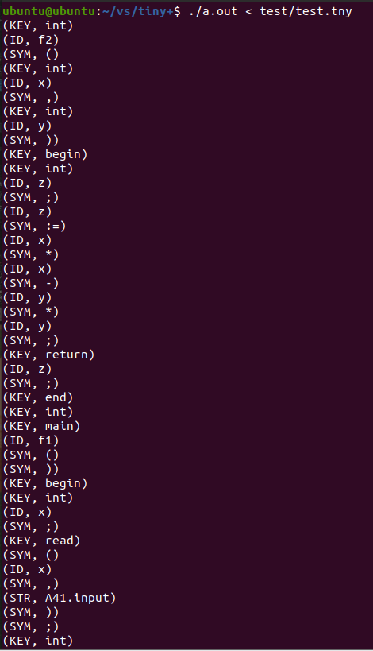
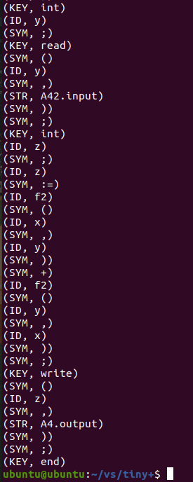
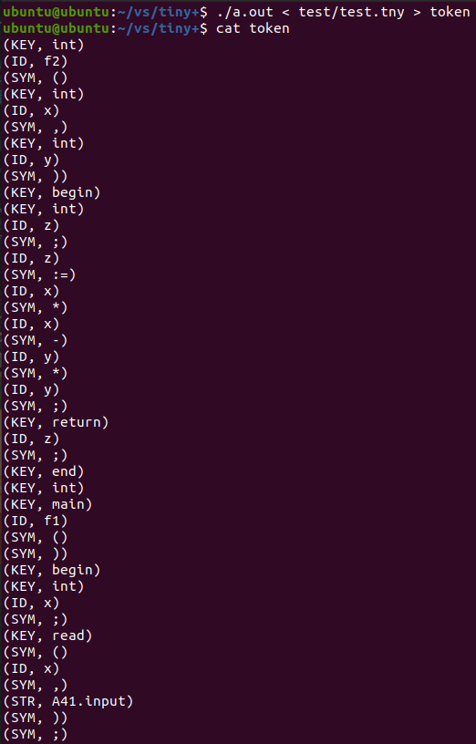
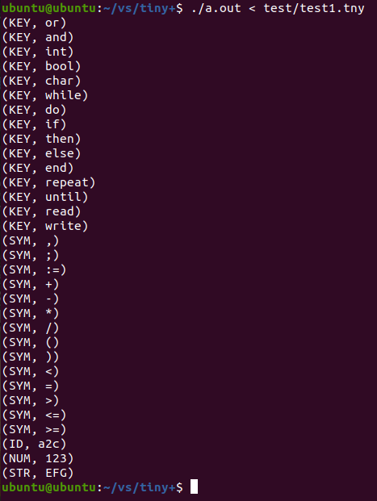
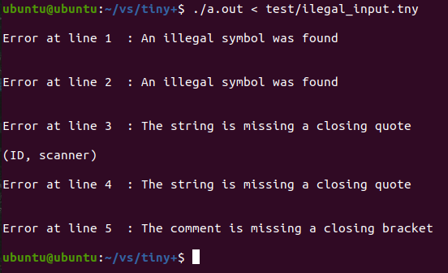

# 词法分析程序实验报告

### 实验环境

+ 架构：Intel x86_64 (虚拟机)
+ 操作系统：Ubuntu 20.04
+ 汇编器：gas (GNU Assembler) in AT&T mode
+ 编译器：gcc

### 实验目的

通过扩充已有的样例语言TINY语言的词法分析程序，为扩展TINY语言TINY+构造词法分析程序，从而掌握词法分析程序的构造方法。

### 实验内容

了解样例语言TINY及TINY编译器的实现，了解扩展TINY语言TINY+，用C语言在已有的TINY词法分析器基础上扩展，构造TINY+的词法分析程序。

### 实验要求

将TINY+源程序翻译成对应的TOKEN序列，并能检查一定的词法错误。

### 项目介绍

源程序：`lex.yy.c`
可执行程序：`a.out`

#### 文件夹结构

```
tiny+
|-- a.out
|-- lex.yy.c
|-- Makefile
|-- scanner
|-- scanner.l
|-- test
    |-- ilegal_input.tny
    |-- test1.tny
    |-- test.tny
|-- token
|-- token.h
```

#### 运行方式

进入`tiny+`文件夹目录，在终端输入：

```
./a.out < test/test.tny          // TINY+样例词法分析序列打印到终端
./a.out < test/test.tny > token  // TINY+样例词法分析序列生成到token文件
./a.out < test/test1.tny         // TINY+合法输入测试
./a.out < ilegal_input.tny       // TINY+词法错误测试
```

### TINY语言

#### 词法定义

+ 关键字：`WRITE READ IF THEN ELSE RETURN BEGIN END MAIN STRING INT REAL REPEAT UNTIL`
+ 单字符分隔符：`; , ( )`
+ 单字符运算符：`+ - * /`
+ 多字符运算符：`:= == != =`
+ 标识符：标识符由一个字母后跟任意数量的字母或数字组成。以下是标识符的示例：x、x2、xx2、x2x、End、END2。注意End是标识符，而END是关键字。以下不是标识符：
  + `IF, WRITE, READ, ....`（关键字不计为标识符）
  + `2x`（标识符不能以数字开头）
  + 注释中的字符串不是标识符。
+ Number 是一个数字序列，或者是一个数字序列，后跟一个点，然后是数字。
   ``` 
   Number -> Digits | Digits '.' Digits
   Digits -> Digit | Digit Digits
   Digit  -> '0' | '1' | '2' | '3' | '4' | '5' | '6' | '7' | '8' | '9'
   ```
+ 注释：`/**` 和 `**/` 之间的字符串。注释可以超过一行。 

#### EBNF 语法

**高级程序结构：**

```
Program -> MethodDecl MethodDecl* 
Type -> INT | REAL |STRING 
MethodDecl -> Type [MAIN] Id '(' FormalParams ')' Block
FormalParams -> [FormalParam ( ',' FormalParam )* ]
FormalParam -> Type Id
```

**声明：**

```
Block -> BEGIN Statement+ END

Statement -> Block
           | LocalVarDecl  
           | AssignStmt   
           | ReturnStmt
           | IfStmt
	   | WriteStmt
	   | ReadStmt
        
LocalVarDecl -> Type Id ';' | Type AssignStmt  

AssignStmt  -> Id := Expression ';'
           |  Id := QString ';'
ReturnStmt -> RETURN Expression ';'
IfStmt    -> IF '(' BoolExpression ')' Statement
            | IF '(' BoolExpression ')' Statement ELSE Statement
WriteStmt -> WRITE '(' Expression ',' QString ')' ';'
ReadStmt  -> READ '(' Id ',' QString ')' ';'
QString 是除双引号本身之外的任何字符序列，用双引号括起来。
```

**表达式：**

```
Expression -> MultiplicativeExpr  (( '+' | '-' ) MultiplicativeExpr)*
MultiplicativeExpr -> PrimaryExpr (( '*' | '/' ) PrimaryExpr)*
PrimaryExpr -> Num  // Integer or Real numbers
             | Id            
             | '(' Expression ')'
             | Id '(' ActualParams ')'
BoolExpression -> Expression '==' Expression 
                 |Expression '!=' Expression   
ActualParams -> [Expression ( ',' Expression)*]
```

**样例：**

```
/** this is a comment line in the sample program **/
INT f2(INT x, INT y ) 
BEGIN 
   INT z;
   z := x*x - y*y;
   RETURN z; 
END 
INT MAIN f1() 
BEGIN
   INT x;
   READ(x, "A41.input");
   INT y;
   READ(y, "A42.input");
   INT z;
   z := f2(x,y) + f2(y,x);
   WRITE (z, "A4.output"); 
END
```

### TINY+

TINY+是对TINY语言的一个扩充，比TINY多了程序的声明部分，while语句，字符串类型定义等等。

#### 词法定义

+ 关键字：在TINY的关键字`write read if then else return begin end main string int real repeat until`的基础上，扩充了`or and bool char while do`这几个关键字，小写字母表示，自定义标识符不能和关键字重复。
+ 特殊符号：在TINY的特殊符号`; , ( ) + - * / := == != =`的基础上，扩充了`> < <= >= '`这几个特殊符号。
+ 其他种类的单词包括标识符ID，数字NUM以及字符串STRING，他们的正规表达式的定义如下：
   + 标识符是以字母开头，由字母和数字混合构成的符号串：
      ```
      ID=letter (letter | digit)*
      ```
   + TINY+中对数字的定义和TINY相同：
      ```
      NUM=digit digit*
      ```
   + 一个字符串类型的单词是用单引号括起来的字符申'…'，引号内可出现除了'以外的任何符号。一个字符串不能跨行定义：
      ```
      STRING=any character except''
      ```
   + 小写和大写字母是不同的：
      ```
      letter=a|...|z|A|...|Z
      digit=0|...|9
      ```
+ 空白包括空格、回车以及Tab。所有的空白在词法分析时，被当作单词ID, NUM以及保留字的分隔符，在词法分析之后，他们不被当作单词保留。
+ 注释是用花括号括起来的符号串{...}，注释不能嵌套定义，但注释的定义可以跨行。

#### EBNF 语法

和TINY相比，扩展的部分有：

```
Statement -> Block
           | LocalVarDecl  
           | AssignStmt   
           | ReturnStmt
           | IfStmt
           | WriteStmt
           | ReadStmt
           | WhileStmt
           | DoWhileStmt
           | ForStmt

WhileStmt -> WHILE '(' BoolExpression ')' Statement
DoWhileStmt -> DO Statement WHILE '(' BoolExpression ')'
ForStmt -> For AssignStmt UPTO Expression DO Statement
         | For AssignStmt DOWNTO Expression DO Statement

MultiplicativeExpr -> PrimaryExpr (( '*' | '/' | '%' ) PrimaryExpr)*
BoolExpression -> Expression '==' Expression
                | Expression '!=' Expression 
                | Expression '>' Expression
                | Expression '<' Expression
```

#### 样例

在之前TINY语言的样例基础上，使用TINY+将样例改动为：

```
{ this is a comment line in the sample program }
int f2(int x, int y ) 
begin 
   int z;
   z := x*x - y*y;
   return z; 
end 
int main f1() 
begin
   int x;
   read(x, 'A41.input');
   int y;
   read(y, 'A42.input');
   int z;
   z := f2(x,y) + f2(y,x);
   write (z, 'A4.output'); 
end
```

### 实现过程

根据课程网站中有关lex工具的资料，可以通过lex生成C语言版的TINY+的词法分析程序。

**首先安装lex工具：**

在Linux上终端输入下列命令：

```
sudo apt-get install flex
```

然后在终端中输入：

```
lex --version
```

如果显示lex的版本，那么安装成功。

**然后创建flex模式文件：**

创建一个`tiny+`目录，进入这个目录中，创建一个`scanner.l`文件，输入下列内容：

```
%{
#include "token.h"
int cur_line_num = 1;
void lex_error(char* msg, int line);
%}

/* Definitions */
KEY                 ("write"|"read"|"if"|"then"|"else"|"return"|"begin"|"end"|"main"|"string"|"int"|"real"|"or"|"and"|"int"|"bool"|"char"|"while"|"do"|"repeat"|"until")
SYM                 (";"|","|"("|")"|"+"|"-"|"*"|"/"|":="|"=="|"!="|">"|"<"|"<="|">="|"="|"'")
ID                  ([a-zA-z][a-zA-Z0-9]*)
NUM                 ([0-9][0-9]*)
STR                 (\'[^\'\n]*\')
UNTERM_STR1         ((\'[^\'\n]*))
UNTERM_STR2         (\'\n)
COMMENT             (\{[^\{\}]*\})
UNTERM_COMMENT      (\{[^\{\}]*[\{]*)
ILLEGAL_SYMBOL      ([^[a-zA-Z0-9]|";"|","|"("|")"|"+"|"-"|"*"|"/"|":="|"=="|"!="|">"|"<"|"<="|">="|"="|"'"])

%%

[\n]                { cur_line_num++;                       }
[ \t\r\a]+          { /* ignore all spaces */               }

{KEY}               { return T_KEY;             }
{SYM}               { return T_SYM;             }
{ID}                { return T_ID;              }
{NUM}               { return T_NUM;             }
{STR}               { return T_STR;             }
{COMMENT}           { /* skip for comment */    }  

{ILLEGAL_SYMBOL}    { lex_error("An illegal symbol was found", cur_line_num);                           }
{UNTERM_STR1}       { lex_error("The string is missing a closing quote", cur_line_num);                 }
{UNTERM_STR2}       { lex_error("The string is missing a closing quote", cur_line_num); cur_line_num++; }
{UNTERM_COMMENT}    { lex_error("The comment is missing a closing bracket", cur_line_num);              }

<<EOF>>             { return 0; }

%%

int main(int argc, char* argv[]) {
    int token;
    while (token = yylex()) {
        print_token(token);
        printf("%s", yytext);
        printf(")\n");
    }
    return 0;
}

void lex_error(char* msg, int line) {
    printf("\nError at line %-3d: %s\n\n", line, msg);
}

int yywrap(void) {
    return 1;
}
```

**flex 模式文件中，%{ 和 %} 之间的为 声明（Declarations）** ，都是 C 代码，这些代码会被原样的复制到 lex.yy.c 文件中，一般在这里声明一些全局变量和函数，这样在后面可以使用这些变量和函数：

```
%{
#include "token.h"
int cur_line_num = 1;
void lex_error(char* msg, int line);
%}
```

cur_line_num用来记录当前扫描到的行号。

**%} 和 %% 之间的为 定义（Definitions）**，在这里可以定义正则表达式中的一些名字，可以在 规则（Rules） 段被使用，如本文件中定义了 NUM 为 ([0-9][0-9]*) ， 这样在后面可以用 {NUM} 代替这个正则表达式，这里根据TINY+语言的要求，定义了五个单词种类，并定义了出现词法错误时进行匹配的串：

```
/* Definitions */
KEY                 ("write"|"read"|"if"|"then"|"else"|"return"|"begin"|"end"|"main"|"string"|"int"|"real"|"or"|"and"|"int"|"bool"|"char"|"while"|"do"|"repeat"|"until")
SYM                 (";"|","|"("|")"|"+"|"-"|"*"|"/"|":="|"=="|"!="|">"|"<"|"<="|">="|"="|"'")
ID                  ([a-zA-z][a-zA-Z0-9]*)
NUM                 ([0-9][0-9]*)
STR                 (\'[^\'\n]*\')
UNTERM_STR1         ((\'[^\'\n]*))
UNTERM_STR2         (\'\n)
COMMENT             (\{[^\{\}]*\})
UNTERM_COMMENT      (\{[^\{\}]*[\{]*)
ILLEGAL_SYMBOL      ([^[a-zA-Z0-9]|";"|","|"("|")"|"+"|"-"|"*"|"/"|":="|"=="|"!="|">"|"<"|"<="|">="|"="|"'"])
```

+ KEY表示关键字；
+ SYM表示特殊符号；
+ ID表示标识符；
+ NUM表示数字常量
+ STR表示字符串常量
+ COMMENT表示注释
+ ILLEGAL_SYMBOL表示非法符号，词法分析器可能识别到一个TINY+程序的字母表中不允许的符号，比如识别到$，那么应报告一个词法错误，发现了一个非法符号；
+ UNTERM_STR1和UNTERM_STR2表示单引号不匹配，例如出现' scanner，应报告错误“字符串缺少右引号”；
+ UNTERM_COMMENT表示注释的括号不匹配，例如出现{this is an example，应报告错误“注释缺少右括号”。

**%% 和 %% 之间的内容被称为 规则（rules）**，本文件中每一行都是一条规则，每条规则由 匹配模式（pattern） 和 事件（action） 组成， 模式在前面，用正则表达式表示，事件在后面，即 C 代码。每当一个模式被匹配到时，后面的 C 代码被执行。

简单来说，flex 会将本段内容翻译成一个名为 yylex 的函数，该函数的作用就是扫描输入文件（默认情况下为标准输入），当扫描到一个完整的、最长的、可以和某条规则的正则表达式所匹配的字符串时，该函数会执行此规则后面的 C 代码。如果这些 C 代码中没有 return 语句，则执行完这些 C 代码后， yylex 函数会继续运行，开始下一轮的扫描和匹配。

当有多条规则的模式被匹配到时， yylex 会选择匹配长度最长的那条规则，如果有匹配长度相等的规则，则选择排在最前面的规则。

```
%%

[\n]                { cur_line_num++;                       }
[ \t\r\a]+          { /* ignore all spaces */               }

{KEY}               { return T_KEY;             }
{SYM}               { return T_SYM;             }
{ID}                { return T_ID;              }
{NUM}               { return T_NUM;             }
{STR}               { return T_STR;             }
{COMMENT}           { /* skip for comment */    }  

{ILLEGAL_SYMBOL}    { lex_error("An illegal symbol was found", cur_line_num);                           }
{UNTERM_STR1}       { lex_error("The string is missing a closing quote", cur_line_num);                 }
{UNTERM_STR2}       { lex_error("The string is missing a closing quote", cur_line_num); cur_line_num++; }
{UNTERM_COMMENT}    { lex_error("The comment is missing a closing bracket", cur_line_num);              }

<<EOF>>             { return 0; }

%%
```

+ 匹配到了普通单词种类`KEY`、`SYM`、`ID`、`NUM`、`STR`会返回一个值，在token.h文件中进行相应的组合token和打印处理；
+ 匹配到了注释`COMMENT`直接跳过，不做任何处理；
+ 匹配到了非法符号`ILLEGAL_SYMBOL`直接跳过该行后面所有内容，并报告错误`An illegal symbol was found`和行号。
+ 匹配到了单引号不匹配`UNTERM_STR1`和`UNTERM_STR2`直接跳过该行后面所有内容，并报告错误`The string is missing a closing quote`和行号。
+ 匹配到了注释的括号不匹配`UNTERM_COMMENT`直接跳过后面所有内容，并报告错误`The comment is missing a closing bracket`和行号。

**最后的 main 函数是程序的入口**， flex 会将这些代码原样的复制到 lex.yy.c 文件的最后面：

```
int main(int argc, char* argv[]) {
    int token;
    while (token = yylex()) {
        print_token(token);
        if (token == (int)TokenType.T_STR) {
            int i = 1;
            while (yytext[i] != '\'') {
                printf("%c", yytext[i]);
                i++;
            }
        }
        else {
            printf("%s", yytext);
        }
        printf(")\n");
    }
    return 0;
}

void lex_error(char* msg, int line) {
    printf("\nError at line %-3d: %s\n\n", line, msg);
}

int yywrap(void) {
    return 1;
}
```

**接着创建`token.h`文件：**

在同一个文件目录下，创建`token.h`文件，并输入内容：

```c
#ifndef TOKEN_H
#define TOKEN_H

typedef enum {
    T_KEY = 256, T_SYM, T_ID, T_NUM, T_STR
} TokenType;

static void print_token(int token) {
    static char* token_strs[] = {
        "KEY", "SYM", "ID", "NUM", "STR"
    };

    if (token < 256) {
        printf("%-20c", token);
    } else z{
        printf("(%s, ", token_strs[token-256]);
    }
}

#endif
```

**最后创建`Makefile`文件：**

在同一个文件目录下，创建`token.h`文件，并输入内容：

```makefile
out: scanner

scanner: lex.yy.c token.h
	gcc -o $@ $<

lex.yy.c: scanner.l
	flex $<
```

**生成源程序和可运行程序：**

进入文件目录下，在终端输入`make`，生成源程序`lex.yy.c`和可运行程序`scanner`。

在终端再输入：

`gcc lex.yy.c`

也可生成可运行程序`a.out`

### 测试报告

#### 样例TINY+测试

在`tiny+`文件夹目录，创建一个`test`文件夹，在这个文件夹中，创建一个test.tny文件，并把TINY+样例放进这个文件里面：

```
{ this is a comment line in the sample program }
int f2(int x, int y ) 
begin 
   int z;
   z := x*x - y*y;
   return z; 
end 
int main f1() 
begin
   int x;
   read(x, 'A41.input');
   int y;
   read(y, 'A42.input');
   int z;
   z := f2(x,y) + f2(y,x);
   write (z, 'A4.output'); 
end
```

回到`tiny+`文件夹目录，在终端输入：

```
./scanner < test/test.tny
```

或

```
./a.out < test/test.tny
```

可以看到：





词法分析成功。

生成token序列，在终端输入：

```
./a.out < test/test.tny > token
```

可以看到：



词法分析的token序列已经被生成到了token文件中。

#### 合法输入测试

在`test`文件夹，创建一个test1.tny文件，输入下列内容：

```
or and int bool char
while do if then else
end repeat until read write
, ; := + -
* / ( ) <
= > <= >= a2c
123 'EFG'
{ this is an example }
{ this 
is 
an 
example
}
```

对所有的关键字KEY、特殊符号SYM、符合格式要求的标识符ID、符号格式要求的数组常量NUM、符号格式要求的字符串常量STR、单行和多行注释COMMENT进行测试，回到`tiny+`文件夹目录，在终端输入：

```
./a.out < test/test1.tny
```

可以看到：



所有的合法输入KEY、SYM、ID、NUM、STR都被识别出来并组成token序列，单行和多行注释也被去掉。

#### 词法错误测试

在`test`文件夹，创建一个ilegal_input.tny文件，输入下列内容：

```
$
#
' scanner
scanner '
{ this is a comment line in the sample program
```

对非法符号错误、单引号不匹配错误、注释的括号不匹配错误进行测试，回到`tiny+`文件夹目录，在终端输入：

```
./a.out < ilegal_input.tny
```

可以看到：



第1行和第2行的非法符号`$`和`#`被识别出来并报告错误`An illegal symbol was found`发现非法符号，第3行和第4行后面的单引号不匹配被识别出来并报告错误`The string is missing a closing quote`没有右引号，第5行的注释的括号不匹配被识别出来并报告错误`The comment is missing a closing bracket`没有右括号。
